# 🎤 AI Interview - Complete Process Guide

## Table of Contents
1. [System Overview](#system-overview)
2. [Interview Configuration](#interview-configuration)
3. [Interview Session Flow](#interview-session-flow)
4. [Voice Integration](#voice-integration)
5. [Question Generation](#question-generation)
6. [Answer Evaluation](#answer-evaluation)
7. [Report Generation](#report-generation)
8. [Database Models](#database-models)
9. [API Endpoints](#api-endpoints)

---

## System Overview

The AI Interview feature provides realistic interview practice with AI-powered question generation, real-time evaluation, and comprehensive feedback. It supports text, voice, and live (voice-to-voice) interview modes.

### Key Technologies
- **AI Engine**: OpenAI GPT-4o (temperature 0.7)
- **Voice STT**: OpenAI Whisper (Python microservice on port 5001)
- **Voice TTS**: Chatterbox (Python microservice on port 5002) + Browser Web Speech API fallback
- **Frontend**: React with real-time audio recording and playback
- **Backend**: Node.js + Express with WebSocket-like streaming

---

## Interview Configuration

### Available Interview Types


### Interview Modes

| Mode | Description | Input | Output | Requirements |
|------|-------------|-------|--------|--------------|
| **Text** | Type your answers | Keyboard | Text display | None |
| **Voice** | Speak answers, read questions | Microphone | Text display | Microphone access |
| **Live** | Real-time AI conversation | Microphone | Audio playback | Mic + Audio service |

### Configuration Options


---

## Interview Session Flow

### Complete Interview Journey

```mermaid
flowchart TD
    Start([User Starts Interview]) --> Configure[Configure Interview:<br/>• Type<br/>• Role<br/>• Experience Level<br/>• Mode<br/>• Total Questions]
    
    Configure --> CreateSession[POST /api/interview/sessions]
    CreateSession --> ValidateReq{Validate Request}
    
    ValidateReq -->|Invalid| Error400[400 Bad Request]
    ValidateReq -->|Valid| CheckResume{Resume Required?}
    
    CheckResume -->|Resume-Based| FetchResume[Fetch Resume from DB]
    CheckResume -->|Other Types| GeneratePrompt
    FetchResume --> ConvertText[Convert Resume to Text]
    ConvertText --> GeneratePrompt[Build System Prompts]
    
    GeneratePrompt --> SaveSession[(Save Session to DB<br/>Status: 'created')]
    SaveSession --> ReturnSession[Return Session ID & Config]
    
    ReturnSession --> UserReady{User Clicks 'Start'}
    UserReady --> StartSession[POST /api/interview/sessions/:id/start]
    
    StartSession --> UpdateStatus[(Update Status: 'in_progress'<br/>Set startedAt timestamp)]
    UpdateStatus --> GenerateQ1[Generate First Question]
    
    GenerateQ1 --> BuildContext[Build Question Context:<br/>• Interview type<br/>• Role & level<br/>• Resume/JD text<br/>• Previous Q&A: none]
    
    BuildContext --> CallGPT4o[OpenAI GPT-4o API Call<br/>Temperature: 0.7]
    CallGPT4o --> ParseQData[Parse Question Data:<br/>• Question text<br/>• Type technical/behavioral<br/>• Category skill topic<br/>• Difficulty easy/medium/hard<br/>• Expected keywords<br/>• Ideal answer points]
    
    ParseQData --> CheckMode{Interview Mode?}
    CheckMode -->|Text| ReturnTextQ[Return Question as Text]
    CheckMode -->|Voice| ReturnTextQ
    CheckMode -->|Live| GenerateTTS[Generate TTS Audio]
    
    GenerateTTS --> CheckChatterbox{Chatterbox Available?}
    CheckChatterbox -->|Yes| UseChatterbox[POST to Chatterbox Service<br/>Port 5002]
    CheckChatterbox -->|No| UseBrowserTTS[Flag: Use Browser TTS]
    
    UseChatterbox --> ReturnAudio[Return Audio Base64<br/>+ Question Text]
    UseBrowserTTS --> ReturnTextQ
    ReturnAudio --> DisplayQ[Display Question in UI]
    ReturnTextQ --> DisplayQ
    
    DisplayQ --> WaitAnswer{Waiting for Answer}
    
    WaitAnswer -->|Text Mode| TypeAnswer[User Types Answer]
    WaitAnswer -->|Voice Mode| RecordVoice[Record Voice Answer]
    WaitAnswer -->|Live Mode| RecordLive[Record Live Response]
    
    RecordVoice --> SendAudio[Send Audio to Backend]
    RecordLive --> SendAudio
    
    SendAudio --> TranscribeSTT[POST /api/voice/transcribe<br/>Proxy to Whisper Service]
    TranscribeSTT --> WhisperService[Whisper STT<br/>OpenAI Whisper Model<br/>Port 5001]
    WhisperService --> GetTranscript[Get Transcribed Text]
    
    TypeAnswer --> SubmitAnswer[POST /api/interview/sessions/:id/answer]
    GetTranscript --> SubmitAnswer
    
    SubmitAnswer --> SaveAnswer[(Save Answer to Session)]
    SaveAnswer --> EvaluateAnswer[Evaluate Answer with GPT-4o]
    
    EvaluateAnswer --> BuildEvalPrompt[Build Evaluator Prompt:<br/>• Question context<br/>• User's answer<br/>• Expected keywords<br/>• Role & level requirements]
    
    BuildEvalPrompt --> CallEvaluator[GPT-4o Evaluation Call]
    CallEvaluator --> ParseEval[Parse Evaluation:<br/>• Overall score 0-100<br/>• Relevance 0-100<br/>• Technical accuracy 0-100<br/>• Clarity 0-100<br/>• Confidence 0-100<br/>• Role fit 0-100<br/>• Strengths list<br/>• Weaknesses list<br/>• Missing keywords<br/>• Suggested answer<br/>• Improvement tips<br/>• Follow-up needed?]
    
    ParseEval --> SaveEval[(Save Evaluation to Question)]
    SaveEval --> CheckProgress{All Questions<br/>Answered?}
    
    CheckProgress -->|No| GenerateNextQ[Generate Next Question]
    GenerateNextQ --> AdaptiveDifficulty{Adjust Difficulty?}
    
    AdaptiveDifficulty --> CheckScores{Check Last 2 Scores}
    CheckScores -->|Both > 70| Increase[Increase Difficulty]
    CheckScores -->|Both < 50| Decrease[Decrease Difficulty]
    CheckScores -->|Mixed| Maintain[Maintain Difficulty]
    
    Increase --> BuildContext
    Decrease --> BuildContext
    Maintain --> BuildContext
    
    CheckProgress -->|Yes| CompleteSession[POST /api/interview/sessions/:id/complete]
    CompleteSession --> MarkComplete[(Update Session:<br/>Status: 'completed'<br/>completedAt timestamp<br/>Calculate totalDuration)]
    
    MarkComplete --> GenerateReport[Generate Comprehensive Report]
    
    GenerateReport --> BuildReportPrompt[Build Report Generator Prompt:<br/>• All questions & answers<br/>• All evaluations<br/>• Interview type & role<br/>• Experience level<br/>• Time taken per question]
    
    BuildReportPrompt --> CallReportAI[GPT-4o Final Report Call]
    CallReportAI --> ParseReport[Parse Report Data:<br/>• Overall score<br/>• Skill breakdown<br/>• Topic breakdown<br/>• Strengths<br/>• Weaknesses<br/>• Resume improvements<br/>• Practice areas<br/>• Hiring recommendation]
    
    ParseReport --> CalcMetrics[Calculate Metrics:<br/>• Avg time per question<br/>• Questions above threshold<br/>• Skip rate<br/>• Consistency score]
    
    CalcMetrics --> ComparePrevious{Previous Interview?}
    ComparePrevious -->|Yes| CalcImprovement[Calculate Improvement %]
    ComparePrevious -->|No| SkipCompare[No comparison]
    
    CalcImprovement --> SaveResult[(Save InterviewResult to DB)]
    SkipCompare --> SaveResult
    
    SaveResult --> ReturnReport[Return Complete Report]
    ReturnReport --> DisplayReport[Display Report in UI:<br/>• Score cards<br/>• Performance graphs<br/>• Detailed feedback<br/>• Action items<br/>• Download options]
    
    DisplayReport --> End([Interview Complete])
    
    style Start fill:#e1f5ff
    style End fill:#c8e6c9
    style Error400 fill:#ffcdd2
    style CallGPT4o fill:#fff3e0
    style EvaluateAnswer fill:#fff3e0
    style GenerateReport fill:#fff3e0
    style DisplayReport fill:#c8e6c9
```



---

## Voice Integration

### Voice Service Architecture


### Voice Flow - Speech to Text (STT)


### Voice Flow - Text to Speech (TTS)


### Voice Recording with Silence Detection

```javascript
// Frontend - Silence Detection Algorithm

class VoiceRecorder {
  constructor() {
    this.silenceThreshold = 0.01;      // Audio level threshold
    this.silenceDuration = 2000;        // 2 seconds of silence
    this.lastSoundTime = Date.now();
  }
  
  analyzeAudio(audioData) {
    // Calculate RMS (Root Mean Square) of audio
    const rms = Math.sqrt(
      audioData.reduce((sum, val) => sum + val * val, 0) / audioData.length
    );
    
    if (rms > this.silenceThreshold) {
      // Sound detected
      this.lastSoundTime = Date.now();
    } else {
      // Silence detected
      const silenceDuration = Date.now() - this.lastSoundTime;
      
      if (silenceDuration > this.silenceDuration) {
        // Auto-stop recording
        this.stopRecording();
      }
    }
  }
}
```

---

## Question Generation

### Question Generation Prompt Structure

```mermaid
graph TB
    Start([Question Generation Request]) --> GatherContext[Gather Context Data]
    
    GatherContext --> Context1[Interview Type]
    GatherContext --> Context2[Role & Experience Level]
    GatherContext --> Context3[Resume/JD Text]
    GatherContext --> Context4[Previous Q&A]
    GatherContext --> Context5[Current Difficulty]
    GatherContext --> Context6[Target Skills]
    
    Context1 --> BuildPrompt[Build System Prompt]
    Context2 --> BuildPrompt
    Context3 --> BuildPrompt
    Context4 --> BuildPrompt
    Context5 --> BuildPrompt
    Context6 --> BuildPrompt
    
    BuildPrompt --> Persona[AI Persona:<br/>• Professional interviewer<br/>• Friendly but thorough<br/>• Scenario-based questions<br/>• No generic textbook questions]
    
    Persona --> Rules[Question Rules:<br/>• ONE question at a time<br/>• Test practical skills<br/>• Match complexity to level<br/>• Avoid revealing AI nature<br/>• Don't give hints in question]
    
    Rules --> Format[Response Format:<br/>JSON with:<br/>• question<br/>• questionType<br/>• category<br/>• difficulty<br/>• expectedKeywords<br/>• idealAnswerPoints]
    
    Format --> CallAI[GPT-4o API Call<br/>Temperature: 0.7<br/>Max Tokens: 500]
    
    CallAI --> Parse{Parse Response}
    Parse -->|Success| ValidateJSON[Validate JSON Structure]
    Parse -->|Error| Retry{Retry Available?}
    
    Retry -->|Yes| CallAI
    Retry -->|No| FallbackQ[Generate Fallback Question]
    
    ValidateJSON --> CheckUnique{Check Against<br/>Previous Questions}
    CheckUnique -->|Duplicate| RegeneratePrompt[Add stricter uniqueness constraint]
    RegeneratePrompt --> CallAI
    CheckUnique -->|Unique| ReturnQ[Return Question Data]
    
    FallbackQ --> ReturnQ
    ReturnQ --> End([Question Ready])
    
    style Start fill:#e1f5ff
    style End fill:#c8e6c9
    style CallAI fill:#fff3e0
    style Persona fill:#f3e5f5
```



### Adaptive Difficulty System


### Question Types by Interview Type

| Interview Type | Question Distribution | Focus Areas |
|----------------|----------------------|-------------|
| **Resume-Based** | 100% Resume-derived | Projects, skills, experiences mentioned |
| **Job Description** | 100% JD-aligned | Required skills, responsibilities |
| **Technical** | 80% Technical, 20% Problem-solving | Coding, system design, architecture |
| **Behavioral** | 100% STAR format | Leadership, teamwork, conflict resolution |
| **Mixed** | 50% Technical, 50% Behavioral | Balanced assessment |

---

## Answer Evaluation

### Evaluation Process

```mermaid
flowchart TD
    Start([Answer Submitted]) --> GetContext[Get Evaluation Context:<br/>• Question text & type<br/>• Expected keywords<br/>• Ideal answer points<br/>• User's answer<br/>• Role & experience level]
    
    GetContext --> BuildPrompt[Build Evaluator System Prompt]
    
    BuildPrompt --> DefineMetrics[Define 5 Evaluation Metrics:<br/>1. Relevance 0-100<br/>2. Technical Accuracy 0-100<br/>3. Clarity 0-100<br/>4. Confidence 0-100<br/>5. Role Fit 0-100]
    
    DefineMetrics --> SetGuidelines[Set Evaluation Guidelines:<br/>• Fair but thorough<br/>• Identify specific strengths<br/>• Constructive criticism<br/>• Provide better answer example<br/>• Actionable tips]
    
    SetGuidelines --> CallAI[GPT-4o Evaluation Call<br/>Temperature: 0.5<br/>For consistency]
    
    CallAI --> ParseResponse{Parse JSON Response}
    
    ParseResponse -->|Error| RetryEval{Retry?}
    RetryEval -->|Yes| CallAI
    RetryEval -->|No| FallbackEval[Generate Basic Evaluation]
    
    ParseResponse -->|Success| ExtractScores[Extract Scores:<br/>• Overall score<br/>• 5 dimension scores<br/>• Strengths list<br/>• Weaknesses list<br/>• Missing keywords<br/>• Suggested answer<br/>• Improvement tips<br/>• Follow-up flag]
    
    FallbackEval --> SaveEval
    ExtractScores --> CalcWeighted[Calculate Weighted Average:<br/>Relevance: 30%<br/>Technical: 25%<br/>Clarity: 20%<br/>Confidence: 15%<br/>Role Fit: 10%]
    
    CalcWeighted --> DetectPattern[Detect Performance Pattern:<br/>• Consistent high?<br/>• Improving trend?<br/>• Declining trend?<br/>• Inconsistent?]
    
    DetectPattern --> CheckFollowUp{Should Ask<br/>Follow-up?}
    
    CheckFollowUp -->|Yes| FlagFollowUp[Set follow-up flag<br/>with reason]
    CheckFollowUp -->|No| NoFollowUp[Continue normally]
    
    FlagFollowUp --> SaveEval[(Save Evaluation<br/>to Question Object)]
    NoFollowUp --> SaveEval
    
    SaveEval --> ReturnFeedback[Return Feedback to User]
    ReturnFeedback --> DisplayUI[Display in UI:<br/>• Score badge<br/>• Strengths 💪<br/>• Areas to improve 📈<br/>• Tips 💡<br/>• Better answer example 📝]
    
    DisplayUI --> End([Evaluation Complete])
    
    style Start fill:#e1f5ff
    style End fill:#c8e6c9
    style CallAI fill:#fff3e0
    style DisplayUI fill:#c8e6c9
```



### Scoring Rubric


### Score Interpretation

| Score Range | Grade | Interpretation |
|-------------|-------|----------------|
| 90-100 | Excellent | Outstanding answer, demonstrates mastery |
| 80-89 | Very Good | Strong answer with minor areas for improvement |
| 70-79 | Good | Solid answer, meets expectations |
| 60-69 | Fair | Acceptable but significant gaps |
| 50-59 | Below Average | Needs considerable improvement |
| 0-49 | Poor | Inadequate understanding or off-topic |

---

## Report Generation

### Final Report Creation Process

```mermaid
flowchart TD
    Start([Interview Completed]) --> GatherData[Gather All Session Data:<br/>• All questions<br/>• All answers<br/>• All evaluations<br/>• Time spent per question<br/>• Skipped questions<br/>• Interview type & role<br/>• Experience level]
    
    GatherData --> CalcBasicMetrics[Calculate Basic Metrics:<br/>• Avg score<br/>• Questions answered<br/>• Questions skipped<br/>• Total time<br/>• Avg time/question<br/>• Questions above 70%<br/>• Consistency score]
    
    CalcBasicMetrics --> BuildPrompt[Build Report Generator Prompt]
    
    BuildPrompt --> StructurePrompt[Prompt Structure:<br/>• Report context<br/>• Requirements<br/>• JSON response format<br/>• Assessment criteria]
    
    StructurePrompt --> CallAI[GPT-4o Report Generation Call<br/>Temperature: 0.6<br/>Max Tokens: 2000]
    
    CallAI --> ParseReport{Parse Report JSON}
    
    ParseReport -->|Error| RetryReport{Retry?}
    RetryReport -->|Yes| CallAI
    RetryReport -->|No| GenerateBasic[Generate Basic Report<br/>from raw scores]
    
    ParseReport -->|Success| ExtractReport[Extract Report Components:<br/>• Overall score<br/>• Skill breakdown<br/>• Topic breakdown<br/>• Strengths<br/>• Weaknesses<br/>• Missed keywords<br/>• Resume improvements<br/>• Practice areas<br/>• Summary<br/>• Detailed feedback<br/>• Hiring recommendation]
    
    GenerateBasic --> EnrichReport
    ExtractReport --> EnrichReport[Enrich with Calculated Data:<br/>• Performance trends<br/>• Time management score<br/>• Consistency metrics<br/>• Category-wise breakdown]
    
    EnrichReport --> ComparePrevious{Previous Interview<br/>Exists?}
    
    ComparePrevious -->|Yes| CalcImprovement[Calculate Improvements:<br/>• Score delta<br/>• Time efficiency<br/>• Skill progress<br/>• Areas improved<br/>• Areas regressed]
    
    ComparePrevious -->|No| SkipComparison[No comparison data]
    
    CalcImprovement --> AddComparison[Add Comparison Section:<br/>• Improvement %<br/>• Before/after charts<br/>• Progress indicators]
    
    SkipComparison --> CreateResult
    AddComparison --> CreateResult[(Create InterviewResult<br/>Document in MongoDB)]
    
    CreateResult --> GenerateCharts[Generate Chart Data:<br/>• Radar chart: skill scores<br/>• Bar chart: topic scores<br/>• Line chart: score progression<br/>• Pie chart: time distribution]
    
    GenerateCharts --> CreateActionItems[Create Action Items:<br/>• Top 3 strengths to leverage<br/>• Top 3 areas to practice<br/>• Specific resources<br/>• Next steps]
    
    CreateActionItems --> FormatOutput[Format for UI Display]
    
    FormatOutput --> ReturnReport[Return Complete Report]
    
    ReturnReport --> End([Report Ready])
    
    style Start fill:#e1f5ff
    style End fill:#c8e6c9
    style CallAI fill:#fff3e0
    style CreateResult fill:#4caf50
```



### Report Structure


---

## Database Models

### InterviewSession Model

```javascript
{
  userId: ObjectId,                     // User reference
  
  // Configuration
  interviewType: String,                // 'resume-based' | 'job-description' | 'technical' | 'behavioral' | 'mixed'
  role: String,                         // 'frontend' | 'backend' | 'fullstack' | etc.
  experienceLevel: String,              // 'fresher' | 'junior' | 'mid' | 'senior' | 'lead'
  mode: String,                         // 'text' | 'voice' | 'live'
  totalQuestions: Number,               // 5-15
  
  // Context
  resumeId: ObjectId,                   // Optional: for resume-based
  resumeText: String,                   // Extracted resume text
  jobDescription: String,               // Optional: for JD-based
  targetSkills: [String],               // Skills to focus on
  
  // Session state
  status: String,                       // 'created' | 'in_progress' | 'completed' | 'abandoned'
  startedAt: Date,
  completedAt: Date,
  totalDurationSeconds: Number,
  
  // Questions
  questions: [{
    questionNumber: Number,
    questionText: String,
    questionType: String,               // 'technical' | 'behavioral' | 'situational' | 'resume-based'
    category: String,                   // Skill/topic being tested
    difficulty: String,                 // 'easy' | 'medium' | 'hard'
    expectedKeywords: [String],
    idealAnswerPoints: [String],
    
    // Answer
    userAnswer: String,
    audioTranscript: String,            // For voice mode
    timeSpentSeconds: Number,
    answeredAt: Date,
    skipped: Boolean,
    
    // Evaluation
    evaluation: {
      score: Number,                    // 0-100
      relevance: Number,
      technicalAccuracy: Number,
      clarity: Number,
      confidence: Number,
      roleFit: Number,
      strengths: [String],
      weaknesses: [String],
      missingKeywords: [String],
      suggestedAnswer: String,
      improvementTips: [String],
      feedback: String
    }
  }],
  
  // AI metadata
  aiModel: String,                      // Always 'gpt-4o' for interviews
  totalTokensUsed: Number,
  totalCost: Number,
  
  // Metadata
  metadata: {
    browserInfo: String,
    ipAddress: String,
    deviceType: String
  },
  
  createdAt: Date,
  updatedAt: Date
}
```

### InterviewResult Model

```javascript
{
  userId: ObjectId,
  sessionId: ObjectId,                  // Reference to InterviewSession
  
  // Overall performance
  overallScore: Number,                 // 0-100
  grade: String,                        // 'A+' | 'A' | 'B+' | etc.
  percentileRank: Number,               // Compared to other users
  
  // Skill breakdown
  skillBreakdown: {
    communication: {
      score: Number,
      feedback: String
    },
    technicalKnowledge: {
      score: Number,
      feedback: String
    },
    problemSolving: {
      score: Number,
      feedback: String
    },
    situationalAwareness: {
      score: Number,
      feedback: String
    },
    culturalFit: {
      score: Number,
      feedback: String
    }
  },
  
  // Topic breakdown
  topicBreakdown: [{
    skillName: String,                  // e.g., 'JavaScript', 'React'
    score: Number,
    questionsAsked: Number,
    feedback: String
  }],
  
  // Feedback
  strengths: [String],
  weaknesses: [String],
  missedKeywords: [String],
  
  // Recommendations
  resumeImprovements: [String],
  practiceAreas: [String],
  
  // Summary
  summary: String,                      // Overall summary paragraph
  detailedFeedback: String,             // Detailed analysis
  
  // Hiring recommendation
  hiringRecommendation: {
    recommendation: String,             // 'hire' | 'maybe' | 'no-hire'
    confidence: Number,                 // 0-100
    reasoning: String
  },
  
  // Metrics
  metrics: {
    answeredQuestions: Number,
    skippedQuestions: Number,
    questionsAboveThreshold: Number,    // Score >= 70
    totalTimeSeconds: Number,
    avgTimePerQuestion: Number,
    consistencyScore: Number,           // How consistent were scores
    improvementFromLast: Number         // % improvement from last interview
  },
  
  // Performance comparison
  comparisonWithPrevious: {
    previousScore: Number,
    scoreDelta: Number,
    improvement: Number,                // Percentage
    areasImproved: [String],
    areasRegressed: [String]
  },
  
  // Charts data
  chartsData: {
    radarChart: Object,                 // Skill scores
    barChart: Object,                   // Topic scores
    lineChart: Object,                  // Score progression
    pieChart: Object                    // Time distribution
  },
  
  createdAt: Date
}
```

---

## API Endpoints

### Get Interview Configuration

**GET** `/api/interview/config`

**Response:**
```json
{
  "success": true,
  "data": {
    "interviewTypes": [...],
    "roles": [...],
    "experienceLevels": [...],
    "modes": [...],
    "limits": {
      "maxQuestions": 15,
      "minQuestions": 5
    },
    "ttsAvailable": true
  }
}
```

---

### Create Interview Session

**POST** `/api/interview/sessions`

**Request:**
```json
{
  "interviewType": "technical",
  "role": "fullstack",
  "experienceLevel": "mid",
  "mode": "live",
  "totalQuestions": 10,
  "resumeId": "resume_id_here",
  "jobDescription": "Optional JD text",
  "targetSkills": ["React", "Node.js", "MongoDB"]
}
```

**Response:**
```json
{
  "success": true,
  "data": {
    "sessionId": "session_id",
    "interviewType": "technical",
    "role": "fullstack",
    "experienceLevel": "mid",
    "mode": "live",
    "totalQuestions": 10,
    "status": "created"
  }
}
```

---

### Start Interview Session

**POST** `/api/interview/sessions/:sessionId/start`

**Response:**
```json
{
  "success": true,
  "data": {
    "question": {
      "number": 1,
      "text": "Can you explain the difference between...",
      "type": "technical",
      "category": "JavaScript",
      "audio": {
        "audioBase64": "...",
        "contentType": "audio/wav",
        "estimatedDuration": 8
      }
    },
    "progress": {
      "current": 0,
      "total": 10,
      "percentage": 0
    }
  }
}
```

---

### Submit Answer

**POST** `/api/interview/sessions/:sessionId/answer`

**Request:**
```json
{
  "questionNumber": 1,
  "answer": "The main difference is...",
  "timeSpentSeconds": 45,
  "audioTranscript": "Optional: transcribed text from voice"
}
```

**Response:**
```json
{
  "success": true,
  "data": {
    "evaluation": {
      "score": 85,
      "feedback": "Excellent answer...",
      "strengths": ["Clear explanation", "Good examples"],
      "weaknesses": ["Could mention edge cases"],
      "improvementTips": ["Consider discussing...", "Add more detail on..."]
    },
    "progress": {
      "current": 1,
      "total": 10,
      "percentage": 10
    },
    "nextQuestion": {
      "number": 2,
      "text": "Next question...",
      ...
    },
    "isComplete": false
  }
}
```

---

### Complete Interview & Get Report

**POST** `/api/interview/sessions/:sessionId/complete`

**Response:**
```json
{
  "success": true,
  "data": {
    "resultId": "result_id",
    "overallScore": 78,
    "grade": "B+",
    "skillBreakdown": {
      "communication": {"score": 82, "feedback": "..."},
      "technicalKnowledge": {"score": 75, "feedback": "..."},
      ...
    },
    "topicBreakdown": [...],
    "strengths": [...],
    "weaknesses": [...],
    "resumeImprovements": [...],
    "practiceAreas": [...],
    "summary": "Overall summary paragraph...",
    "detailedFeedback": "Detailed analysis...",
    "hiringRecommendation": {
      "recommendation": "maybe",
      "confidence": 72,
      "reasoning": "..."
    },
    "metrics": {...},
    "comparisonWithPrevious": {...},
    "chartsData": {...}
  }
}
```

---

### Voice Transcription

**POST** `/api/voice/transcribe`

**Request:**
- `multipart/form-data` with `audio` field

**Response:**
```json
{
  "transcription": "Transcribed text here...",
  "language": "en",
  "duration": 5.2
}
```

---

### Voice Synthesis (TTS)

**POST** `/api/voice/synthesize`

**Request:**
```json
{
  "text": "Question text to synthesize",
  "language": "en"
}
```

**Response:**
```json
{
  "success": true,
  "audio": {
    "audioBase64": "base64_encoded_wav",
    "contentType": "audio/wav",
    "duration": 8
  }
}
```

---

## Performance Optimization

### Caching Strategy
- Question templates cached per role/level combination
- Previous interview results cached for comparison
- Voice synthesis cache for common phrases

### Concurrent Processing
- Question generation and audio synthesis happen in parallel
- Evaluation starts while next question is being generated
- Report generation uses cached intermediate calculations

---

## Error Handling

### Common Error Scenarios

1. **AI Service Timeout**
   - Retry with exponential backoff (3 attempts)
   - Return generic question/evaluation if all retries fail

2. **Voice Service Down**
   - Chatterbox unavailable → fallback to browser TTS
   - Whisper unavailable → Return error, ask for text input

3. **Invalid Audio Format**
   - Convert to supported format on backend
   - Return clear error if conversion fails

4. **Session Expired**
   - Check session age before operations
   - Auto-abandon after 2 hours of inactivity

---

## Security & Privacy

1. **Audio Data**
   - Audio files not permanently stored
   - Transcripts saved only with user consent
   - Auto-delete after 30 days

2. **Interview Data**
   - Encrypted at rest in MongoDB
   - Access controlled by user authentication
   - Export functionality for user data portability

3. **Rate Limiting**
   - Max 3 active sessions per user
   - Max 1 interview per hour per user
   - Max 50 interviews per month (free tier)

---

## Monitoring & Analytics

### Key Metrics Tracked

- **Interview Completion Rate**: % of started interviews that finish
- **Average Interview Duration**: Time spent by interview type
- **Score Distribution**: Histogram of overall scores
- **Question Difficulty Balance**: Distribution of easy/medium/hard
- **Voice Service Uptime**: TTS and STT service availability
- **AI Response Times**: Latency for question generation and evaluation
- **Error Rates**: Failed API calls, transcription errors

---

## Future Enhancements

- [ ] Multi-language support for non-English interviews
- [ ] Video recording option for practice
- [ ] Live coding challenges integration
- [ ] Collaborative interviews (with other humans)
- [ ] Industry-specific interview templates
- [ ] Integration with job boards for JD auto-import
- [ ] Mobile app with native voice support
- [ ] AI interviewer personality customization

---

**Last Updated**: February 2026  
**Version**: 2.0  
**Maintained by**: SmartNShine Development Team
