# 📄 Resume Generation & ATS Scoring - Complete Process Guide

## Table of Contents
1. [System Overview](#system-overview)
2. [Resume Generation Flow](#resume-generation-flow)
3. [ATS Scoring Process](#ats-scoring-process)
4. [AI Routing Strategy](#ai-routing-strategy)
5. [Database Models](#database-models)
6. [API Endpoints](#api-endpoints)
7. [Usage Tracking](#usage-tracking)

---

## System Overview

SmartNShine uses AI-powered resume building with intelligent ATS (Applicant Tracking System) analysis. The system supports multiple AI providers (Google Gemini and OpenAI GPT-4o) and routes requests based on user subscription tiers.

### Key Technologies
- **Frontend**: React 18 + Vite + TailwindCSS + TipTap Editor
- **Backend**: Node.js + Express + MongoDB
- **AI Services**: Google Gemini (free tier) & OpenAI GPT-4o (paid tiers)
- **Text Extraction**: pdf-parse, mammoth (for DOCX)
- **Authentication**: JWT + Passport.js

---

## Resume Generation Flow

### 1. Resume Upload & Parsing Process


### 2. Resume Enhancement Flow

```mermaid
flowchart TD
    Start([User Enhances Content]) --> CheckAuth{Authenticated?}
    CheckAuth -->|No| Error[401 Unauthorized]
    CheckAuth -->|Yes| GetContent[Get Section Content]
    
    GetContent --> ValidateInput{Content Valid?}
    ValidateInput -->|No| InputError[400 Invalid Input]
    ValidateInput -->|Yes| CheckTier{Check User Tier}
    
    CheckTier --> SelectAI{AI Service Selection}
    SelectAI -->|Free| Gemini[Gemini AI]
    SelectAI -->|Pro/Premium/Lifetime| GPT4o[GPT-4o]
    
    Gemini --> BuildPrompt[Build Enhancement Prompt:<br/>• Action: make_professional<br/>• Action: make_impactful<br/>• Action: quantify_achievements<br/>• Action: improve_keywords]
    GPT4o --> BuildPrompt
    
    BuildPrompt --> CallAI[AI API Call]
    CallAI --> ParseResponse{Parse AI Response}
    
    ParseResponse -->|Success| ExtractEnhanced[Extract Enhanced Content]
    ParseResponse -->|Error| RetryLogic{Retry Available?}
    
    RetryLogic -->|Yes| CallAI
    RetryLogic -->|No| AIError[500 AI Service Error]
    
    ExtractEnhanced --> TrackTokens[Track Token Usage]
    TrackTokens --> LogUsage[Log to AIUsage DB]
    LogUsage --> Return[Return Enhanced Content]
    Return --> End([Complete])
    
    style Start fill:#e1f5ff
    style End fill:#c8e6c9
    style Error fill:#ffcdd2
    style InputError fill:#ffcdd2
    style AIError fill:#ffcdd2
    style BuildPrompt fill:#fff3e0
```



### 3. Resume Creation in Editor

```mermaid
flowchart LR
    Start([Open Editor]) --> ChooseMethod{Choose Method}
    
    ChooseMethod -->|Upload| Upload[Upload Resume File]
    ChooseMethod -->|Scratch| Manual[Create from Scratch]
    ChooseMethod -->|GitHub| GitHub[Import from GitHub]
    
    Upload --> Parse[AI Parse Resume]
    GitHub --> FetchGitHub[Fetch GitHub Profile]
    FetchGitHub --> AIProcess[AI: Convert to Resume]
    
    Parse --> LoadEditor[Load into TipTap Editor]
    AIProcess --> LoadEditor
    Manual --> LoadEditor
    
    LoadEditor --> SelectTemplate[Select Resume Template]
    SelectTemplate --> EditSections[Edit Sections:<br/>• Personal Info<br/>• Summary<br/>• Experience<br/>• Education<br/>• Skills<br/>• Projects<br/>• Custom Sections]
    
    EditSections --> UseAI{Use AI Enhancement?}
    UseAI -->|Yes| AIEnhance[AI Enhance Content]
    UseAI -->|No| ManualEdit[Manual Editing]
    
    AIEnhance --> Preview[Live Preview]
    ManualEdit --> Preview
    
    Preview --> Satisfied{Satisfied?}
    Satisfied -->|No| EditSections
    Satisfied -->|Yes| Save[Save Resume to DB]
    Save --> End([Resume Saved])
    
    style Start fill:#e1f5ff
    style End fill:#c8e6c9
    style AIProcess fill:#fff3e0
    style AIEnhance fill:#fff3e0
```



---

## ATS Scoring Process

### Complete ATS Analysis Flow

```mermaid
flowchart TD
    Start([User Requests ATS Score]) --> CheckAuth{Authenticated?}
    CheckAuth -->|No| AuthError[401 Unauthorized]
    CheckAuth -->|Yes| ValidateInput{Validate Input}
    
    ValidateInput --> CheckJD{Job Description<br/>Provided?}
    CheckJD -->|No| JDError[400 JD Required]
    CheckJD -->|Yes| CheckResumeSource{Resume Source?}
    
    CheckResumeSource -->|File Upload| ExtractFile[Extract Text from File:<br/>• PDF → pdf-parse<br/>• DOCX → mammoth]
    CheckResumeSource -->|Resume ID| FetchDB[Fetch Resume from DB]
    
    ExtractFile --> ValidateText{Text Valid?}
    FetchDB --> ConvertToText[Convert Resume Object to Text]
    ConvertToText --> ValidateText
    
    ValidateText -->|No| TextError[400 No Text Extracted]
    ValidateText -->|Yes| GetUser[Get User & Subscription Info]
    
    GetUser --> DetermineAI{Determine AI Service}
    DetermineAI -->|Free| GeminiService[Google Gemini]
    DetermineAI -->|Pro/Premium/Lifetime| GPT4oService[OpenAI GPT-4o]
    
    GeminiService --> BuildATSPrompt[Build ATS Analysis Prompt]
    GPT4oService --> BuildATSPrompt
    
    BuildATSPrompt --> ATSPrompt[ATS Prompt Structure:<br/>1. Resume Text<br/>2. Job Description<br/>3. Analysis Requirements]
    
    ATSPrompt --> CallAI[AI API Call]
    CallAI --> AIAnalysis[AI Analyzes:<br/>• Keyword Match<br/>• Skills Gap<br/>• Experience Fit<br/>• Education Match<br/>• Format Quality]
    
    AIAnalysis --> ParseResult{Parse AI Response}
    ParseResult -->|Error| RetryAI{Retry?}
    RetryAI -->|Yes| CallAI
    RetryAI -->|No| AIError[500 Analysis Failed]
    
    ParseResult -->|Success| ExtractScores[Extract Scores & Metrics]
    ExtractScores --> CalculateOverall[Calculate Overall Score]
    
    CalculateOverall --> GenerateReport[Generate ATS Report:<br/>• Overall Score 0-100<br/>• Keyword Match %<br/>• Section Scores<br/>• Missing Keywords<br/>• Improvement Suggestions<br/>• Strengths<br/>• Weaknesses]
    
    GenerateReport --> TrackUsage[Track AI Usage]
    TrackUsage --> LogMetrics[Log to Database:<br/>• AIUsage<br/>• UsageLog<br/>• Token Count<br/>• Cost]
    
    LogMetrics --> ReturnReport[Return ATS Report to User]
    ReturnReport --> DisplayUI[Display in UI:<br/>• Score Gauge<br/>• Breakdown Charts<br/>• Keyword Highlights<br/>• Action Items]
    
    DisplayUI --> End([Analysis Complete])
    
    style Start fill:#e1f5ff
    style End fill:#c8e6c9
    style AuthError fill:#ffcdd2
    style JDError fill:#ffcdd2
    style TextError fill:#ffcdd2
    style AIError fill:#ffcdd2
    style BuildATSPrompt fill:#fff3e0
    style AIAnalysis fill:#fff3e0
```



### ATS Score Calculation Details


---

## AI Routing Strategy

### AI Service Selection Logic


### Tier-Based Features

| Tier | AI Model | Daily AI Extractions | Resume Storage | ATS Scans |
|------|----------|---------------------|----------------|-----------|
| **Free** | Gemini (with fallback) | 3 | 3 | Unlimited |
| **One-Time** | GPT-4o | 5 | 5 | Unlimited |
| **Pro** | Hybrid (70/30) | 20 | 20 | Unlimited |
| **Student** | Hybrid (70/30) | 15 | 15 | Unlimited |
| **Premium** | GPT-4o | Unlimited | Unlimited | Unlimited |
| **Lifetime** | GPT-4o | Unlimited | Unlimited | Unlimited |

---

## Database Models

### Resume Model Schema

```javascript
{
  userId: ObjectId,                    // Reference to User
  title: String,                       // Resume title/name
  templateId: String,                  // Template identifier
  
  // Personal Information
  personalInfo: {
    fullName: String,
    email: String,
    phone: String,
    location: String,
    linkedin: String,
    github: String,
    portfolio: String,
    profileImage: String
  },
  
  // Professional Summary
  summary: {
    content: String,
    aiGenerated: Boolean,
    lastEnhanced: Date
  },
  
  // Work Experience
  experience: [{
    company: String,
    position: String,
    location: String,
    startDate: Date,
    endDate: Date,
    current: Boolean,
    description: String,
    achievements: [String],
    aiEnhanced: Boolean
  }],
  
  // Education
  education: [{
    institution: String,
    degree: String,
    field: String,
    location: String,
    graduationDate: Date,
    gpa: Number,
    achievements: [String]
  }],
  
  // Skills
  skills: {
    technical: [String],
    soft: [String],
    languages: [String],
    frameworks: [String],
    tools: [String],
    categorized: Boolean,
    aiCategorized: Boolean
  },
  
  // Projects
  projects: [{
    name: String,
    description: String,
    technologies: [String],
    link: String,
    achievements: [String]
  }],
  
  // Certifications
  certifications: [{
    name: String,
    issuer: String,
    date: Date,
    expiryDate: Date,
    credentialId: String,
    credentialUrl: String
  }],
  
  // Custom Sections
  customSections: [{
    title: String,
    content: String,
    order: Number
  }],
  
  // Metadata
  rawText: String,                     // Original extracted text
  atsScore: Number,                    // Latest ATS score
  lastATSAnalysis: Date,
  aiProvider: String,                  // 'gemini' or 'openai'
  
  createdAt: Date,
  updatedAt: Date
}
```

### AI Usage Model Schema

```javascript
{
  userId: ObjectId,
  aiProvider: String,                  // 'gemini' or 'openai'
  aiModel: String,                     // 'gemini-pro' or 'gpt-4o'
  feature: String,                     // 'resume_enhancement', 'ats_analysis', etc.
  tokensUsed: Number,
  cost: Number,                        // In USD
  responseTime: Number,                // Milliseconds
  status: String,                      // 'success' or 'error'
  errorMessage: String,
  metadata: {
    action: String,
    resumeId: ObjectId,
    tier: String
  },
  timestamp: Date
}
```

---

## API Endpoints

### Resume Upload & Parsing

**POST** `/api/resume/upload`

**Request:**
- **Headers**: `Authorization: Bearer <JWT>`
- **Body**: `multipart/form-data` with `file` field (PDF or DOCX)

**Response:**
```json
{
  "message": "Resume uploaded and parsed successfully",
  "data": {
    "personalInfo": { ... },
    "experience": [ ... ],
    "education": [ ... ],
    "skills": { ... },
    "rawText": "..."
  },
  "aiUsed": "gemini",
  "extractionsRemaining": 2
}
```

### Resume Enhancement

**POST** `/api/resume/enhance`

**Request:**
```json
{
  "content": "Original content text",
  "action": "make_professional",
  "context": {
    "section": "experience",
    "role": "Software Engineer"
  }
}
```

**Response:**
```json
{
  "originalContent": "...",
  "enhancedContent": "...",
  "suggestions": ["suggestion1", "suggestion2"],
  "keywordsAdded": ["keyword1", "keyword2"]
}
```

### ATS Score Analysis

**POST** `/api/ats/analyze-resume`

**Request:**
```json
{
  "resumeId": "resume_id",
  "jobDescription": "Full job description text..."
}
```

**Response:**
```json
{
  "atsScore": 85,
  "overallMatch": 85,
  "keywordMatch": 78,
  "skillsMatch": 90,
  "experienceMatch": 82,
  "educationMatch": 88,
  "formatQuality": 95,
  "strengths": [
    "Strong technical skills alignment",
    "Relevant experience"
  ],
  "weaknesses": [
    "Missing keywords: Docker, Kubernetes",
    "Lacks quantified achievements"
  ],
  "missingKeywords": ["Docker", "Kubernetes", "CI/CD"],
  "recommendations": [
    "Add metrics to achievements",
    "Include specific technologies mentioned in JD"
  ],
  "matchedSkills": ["JavaScript", "React", "Node.js"],
  "missingSkills": ["Docker", "Kubernetes"]
}
```

---

## Usage Tracking

### AI Usage Flow


### Cost Tracking

**Token Cost Calculation:**

| Provider | Model | Input Cost | Output Cost |
|----------|-------|-----------|-------------|
| Google | Gemini Pro | $0.0005 / 1K tokens | $0.0015 / 1K tokens |
| OpenAI | GPT-4o | $0.005 / 1K tokens | $0.015 / 1K tokens |

**Cost Formula:**
```javascript
cost = (inputTokens / 1000 * inputRate) + (outputTokens / 1000 * outputRate)
```

---

## Error Handling

### Common Error Scenarios

1. **Quota Exceeded (429)**
   - **Gemini**: Return 403 with upgrade prompt
   - **OpenAI**: Implement exponential backoff retry

2. **Invalid File Format**
   - Return 400 with supported formats

3. **Text Extraction Failed**
   - Return 400 with helpful message

4. **AI Service Down**
   - Retry with exponential backoff (max 3 attempts)
   - Fallback to alternative service if available

5. **Daily Limit Reached**
   - Return 403 with limit information and reset time

---

## Performance Optimization

### Caching Strategy
- Resume text extraction cached after first parse
- ATS analysis cached per resume-JD pair for 24 hours
- Template data cached in memory

### Rate Limiting
- Per-user: 10 requests/minute for AI operations
- Global: 100 requests/minute per API endpoint

---

## Security Measures

1. **File Upload Validation**
   - Max file size: 10MB
   - Allowed types: PDF, DOCX only
   - Virus scanning (optional)

2. **Input Sanitization**
   - Strip harmful content from text
   - Validate JSON structure
   - SQL injection prevention

3. **JWT Authentication**
   - Token expiry: 7 days
   - Refresh token mechanism
   - Role-based access control

---

## Monitoring & Analytics

### Key Metrics Tracked

- **AI Usage Metrics**: Tokens, costs, response times
- **User Metrics**: Extractions per user, tier distribution
- **Performance Metrics**: API response times, error rates
- **Business Metrics**: Conversion rates, feature usage

---

**Last Updated**: February 2026  
**Version**: 2.0  
**Maintained by**: SmartNShine Development Team
