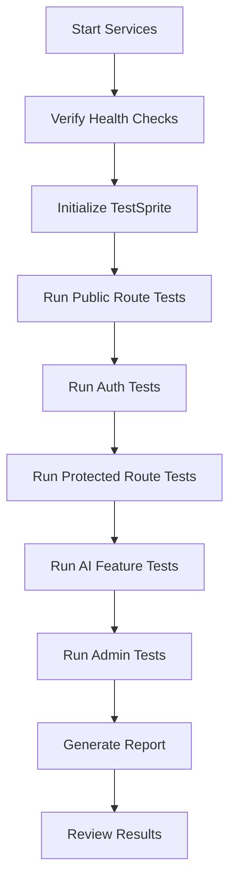

# TestSprite Testing Documentation - Summary

## 📚 Documentation Overview

This project now includes comprehensive TestSprite testing documentation:

### **1. TESTSPRITE_FRONTEND_SPEC.md** 
**Complete Frontend Testing Specification**
- Detailed route documentation (24 routes)
- User flow descriptions
- Component testing guidelines
- API endpoint reference
- Authentication workflows
- UI/UX testing checklist
- Edge cases and error scenarios
- Test data examples

**Key Sections:**
- 7 Public routes (Home, Login, Register, etc.)
- 8 Protected routes (Dashboard, Editor, ATS Analyzer, etc.)
- 9 Admin routes (User Management, Analytics, etc.)
- 5 Critical user flows to test
- Complete API endpoint reference
- Responsive design & accessibility checklist

### **2. TESTSPRITE_BACKEND_SPEC.md**
**Complete Backend API Testing Specification**
- All API endpoints documented (38+ endpoints)
- Request/response examples
- Authentication & authorization details
- Error response codes
- Rate limiting information
- Security specifications
- Testing checklist

**Key Sections:**
- Authentication endpoints (8)
- Resume endpoints (12)
- ATS analysis endpoints (1)
- ML job matching endpoints (3)
- Contact & feedback endpoints (2)
- GitHub integration endpoints (2)
- Admin endpoints (10+)
- Security & rate limiting specs

### **3. TESTSPRITE_QUICK_START.md**
**Quick Reference Guide**
- 60-second setup instructions
- Pre-test checklist
- High-priority test scenarios (P0, P1)
- Test credentials
- Common issues & solutions
- Troubleshooting commands

**Perfect for:**
- Quick test execution
- First-time setup
- Rapid troubleshooting
- CI/CD integration

### **4. testsprite.config.json**
**TestSprite Configuration File**
- Project metadata
- Frontend & backend configurations
- Test user credentials
- Detailed test scenarios (10 scenarios)
- Test data references
- Validation criteria
- Coverage metrics

**Includes:**
- P0 scenarios (critical): 5
- P1 scenarios (important): 4
- P2 scenarios (nice-to-have): 1
- Complete test data examples
- Environment setup requirements

---

## 🚀 Quick Start

### **Step 1: Start Services**
```bash
# Terminal 1: Backend
cd server && npm run dev

# Terminal 2: Frontend  
cd client && npm run dev

# Terminal 3: (Optional) ML Service
cd ml-service && python app.py
```

### **Step 2: Verify Setup**
```bash
# Check backend
curl http://localhost:5000/api/health

# Check frontend
open http://localhost:5173
```

### **Step 3: Initialize TestSprite**
```bash
# Run TestSprite with configuration
testsprite bootstrap-tests \
  --localPort 5173 \
  --type frontend \
  --projectPath "$(pwd)" \
  --testScope codebase
```

### **Step 4: Execute Tests**
Follow the test scenarios in `testsprite.config.json` or let TestSprite auto-discover.

---

## 🎯 What TestSprite Should Test

### **Critical Features (Must Test):**
✅ User registration & login  
✅ Resume upload (PDF/DOCX)  
✅ AI resume parsing  
✅ Resume editing (all sections)  
✅ Resume save/load/delete  
✅ AI content enhancement  
✅ ATS analysis vs job description  
✅ Template selection & preview  
✅ PDF export  

### **Important Features (Should Test):**
✅ Dashboard resume management  
✅ ML job matching (if service running)  
✅ OAuth login (Google/GitHub)  
✅ Form validations  
✅ Error handling  
✅ Dark mode toggle  
✅ Mobile responsiveness  

### **Admin Features (Optional):**
✅ Admin dashboard access  
✅ User management  
✅ AI analytics & quota  
✅ Contact message handling  

---

## 📊 Test Coverage Summary

| Category | Total | Documented |
|----------|-------|------------|
| **Routes** | 24 | 24 (100%) |
| **API Endpoints** | 38+ | 38+ (100%) |
| **User Flows** | 10 | 10 (100%) |
| **Test Scenarios** | 10 | 10 (100%) |
| **Components** | 50+ | Key components |
| **Error Cases** | 20+ | 20+ |

---

## 🔧 Configuration Files

### **Frontend Configuration:**
```json
{
  "type": "frontend",
  "localPort": 5173,
  "pathname": "/",
  "testScope": "codebase",
  "needLogin": true,
  "framework": "React + Vite"
}
```

### **Backend Configuration:**
```json
{
  "type": "backend",
  "localPort": 5000,
  "baseURL": "http://localhost:5000/api",
  "testScope": "api",
  "needAuth": true
}
```

---

## 📝 Test Scenarios Summary

### **P0 - Critical (Must Pass):**
1. **User Registration & Login** - Basic auth flow
2. **Resume Upload & Parse** - Core functionality
3. **Resume Editing & Save** - Data persistence
4. **AI Content Enhancement** - AI integration
5. **ATS Resume Analysis** - Primary feature

### **P1 - Important:**
6. **Template Selection** - UX feature
7. **PDF Export** - Output generation
8. **Dashboard Management** - CRUD operations
9. **ML Job Matching** - Advanced analysis

### **P2 - Optional:**
10. **GitHub Project Import** - Integration feature

---

## 🧪 Test Data Provided

### **Sample Files:**
- `sample-resume.pdf` - Valid PDF (create in `/tests/fixtures/`)
- `sample-resume.docx` - Valid DOCX
- `invalid-file.txt` - For error testing
- `large-file.pdf` - Size limit testing (>5MB)
- `sample-job-description.txt` - Job description for ATS

### **Test Users:**
```javascript
// Regular User
email: "testuser@example.com"
password: "Test123456"

// Admin User  
email: "admin@example.com"
password: "Admin123456"
```

### **Sample Resume Data:**
Complete JSON resume structure provided in config file.

---

## ✅ Success Criteria

Tests are successful if:
- ✅ All P0 scenarios pass
- ✅ 80%+ of P1 scenarios pass
- ✅ No critical errors in console
- ✅ Forms validate correctly
- ✅ API responses match specifications
- ✅ Authentication persists across sessions
- ✅ AI features return valid results
- ✅ Error handling works gracefully

---

## 🐛 Known Limitations

1. **AI Rate Limits** - Gemini API has usage quotas
2. **File Size** - 5MB max for uploads (by design)
3. **ML Service** - Optional, may not be running
4. **OAuth** - Requires valid client IDs (may be skipped)
5. **Email** - Password reset emails may not send in dev

---

## 📞 Troubleshooting

### **Services Not Starting:**
```bash
# Check ports
lsof -i :5000  # Backend
lsof -i :5173  # Frontend

# Check MongoDB
mongosh mongodb://localhost:27017/smartnshine
```

### **Authentication Issues:**
```bash
# Clear localStorage in browser console
localStorage.clear()

# Create test user manually
cd server && node --env-file=.env scripts/createTestUser.js
```

### **AI Features Failing:**
```bash
# Verify API key
echo $GEMINI_API_KEY

# Check server logs for errors
cd server && npm run dev
```

---

## 📖 Documentation Files

| File | Purpose | Size |
|------|---------|------|
| `TESTSPRITE_FRONTEND_SPEC.md` | Complete frontend spec | ~25KB |
| `TESTSPRITE_BACKEND_SPEC.md` | Complete API spec | ~20KB |
| `TESTSPRITE_QUICK_START.md` | Quick reference | ~8KB |
| `testsprite.config.json` | Configuration | ~6KB |
| `TESTSPRITE_SUMMARY.md` | This file | ~4KB |

**Total Documentation:** ~63KB of comprehensive testing specs

---

## 🚦 Test Execution Workflow



---

## 🎓 For TestSprite AI

### **Understanding the Application:**
This is a full-stack MERN (MongoDB, Express, React, Node.js) resume builder with:
- **Frontend:** React 18 + Vite on port 5173
- **Backend:** Express.js API on port 5000
- **AI:** Google Gemini for content enhancement
- **ML:** Optional Python service for job matching

### **Key Testing Focus:**
1. **Authentication Flow** - Users must login for most features
2. **File Upload** - Core feature, test thoroughly
3. **AI Integration** - May have delays (3-10 seconds), handle gracefully
4. **Data Persistence** - Verify save/load/update operations
5. **Error Handling** - Test edge cases and failures

### **Test Execution Tips:**
- Start with public routes (no auth)
- Test authentication before protected routes
- Wait for AI operations to complete (loading states)
- Verify data persists after page refresh
- Test error scenarios (wrong file type, network errors)
- Check mobile responsiveness (3 breakpoints)

---

## 📅 Maintenance

**Last Updated:** November 11, 2025  
**Documentation Version:** 1.0.0  
**Project Version:** 1.0.0  

**Update Triggers:**
- New routes added
- API endpoints changed
- New features implemented
- Test scenarios modified
- Configuration changes

---

## ✨ Next Steps

1. **Review** all documentation files
2. **Setup** test environment (services + DB)
3. **Create** test users and sample data
4. **Execute** P0 scenarios first
5. **Expand** to P1 and P2 scenarios
6. **Generate** test reports
7. **Fix** any failing tests
8. **Iterate** until all critical tests pass

---

**Happy Testing! 🚀**

For detailed information, refer to the specific documentation files listed above.
