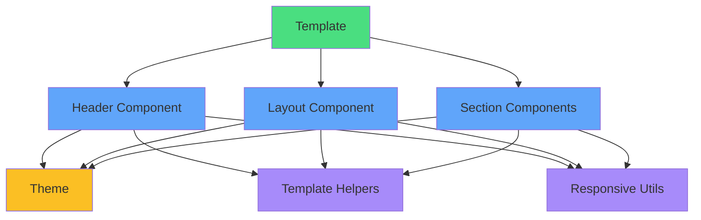

# 📁 Template System File Structure

## Current File Tree

```
client/src/components/templates/
│
├── 📂 components/                    # Reusable building blocks
│   ├── 📂 headers/                   # Header components
│   │   ├── ✅ HeaderModern.jsx      # Gradient header (COMPLETE)
│   │   ├── ⏳ HeaderClassic.jsx     # Traditional centered
│   │   ├── ⏳ HeaderMinimal.jsx     # Clean single-line
│   │   ├── ⏳ HeaderSidebar.jsx     # Vertical sidebar
│   │   └── ⏳ HeaderCentered.jsx    # Centered with dividers
│   │
│   ├── 📂 sections/                  # Content sections
│   │   ├── 📂 experience/
│   │   │   ├── ⏳ ExperienceTimeline.jsx
│   │   │   ├── ⏳ ExperienceCards.jsx
│   │   │   └── ⏳ ExperienceList.jsx
│   │   │
│   │   ├── 📂 skills/
│   │   │   ├── ⏳ SkillsBar.jsx
│   │   │   ├── ⏳ SkillsPills.jsx
│   │   │   ├── ⏳ SkillsGrid.jsx
│   │   │   └── ⏳ SkillsCloud.jsx
│   │   │
│   │   ├── 📂 education/
│   │   │   ├── ⏳ EducationList.jsx
│   │   │   └── ⏳ EducationCards.jsx
│   │   │
│   │   └── 📂 projects/
│   │       ├── ⏳ ProjectsGrid.jsx
│   │       └── ⏳ ProjectsList.jsx
│   │
│   ├── 📂 layouts/                   # Layout wrappers
│   │   ├── ⏳ SingleColumn.jsx
│   │   ├── ⏳ TwoColumn.jsx
│   │   ├── ⏳ SidebarLeft.jsx
│   │   └── ⏳ SidebarRight.jsx
│   │
│   └── 📂 ui/                        # UI primitives
│       ├── ⏳ Badge.jsx
│       ├── ⏳ Card.jsx
│       ├── ⏳ Divider.jsx
│       ├── ⏳ ProgressBar.jsx
│       └── ⏳ Icon.jsx
│
├── 📂 themes/                        # Theme configurations ✅
│   ├── ✅ professional.js           # Corporate blue theme
│   ├── ✅ creative.js               # Purple/pink creative
│   ├── ✅ minimal.js                # Black & white minimal
│   ├── ✅ tech.js                   # Cyan tech theme
│   ├── ✅ executive.js              # Dark slate executive
│   └── ✅ index.js                  # Theme registry
│
├── 📂 utils/                         # Helper functions ✅
│   ├── ✅ templateHelpers.js        # Formatting helpers
│   └── ✅ responsive.js             # Responsive utilities
│
└── 📂 templates/                     # Final templates (existing)
    ├── ProfessionalTemplate.jsx
    ├── ClassicTemplate.jsx
    ├── ModernTemplate.jsx
    ├── MinimalTemplate.jsx
    ├── ExecutiveTemplate.jsx
    ├── TechTemplate.jsx
    ├── CreativeTemplate.jsx
    ├── AcademicTemplate.jsx
    └── ⏳ CorporateProfessionalTemplate.jsx (NEW - To be built)
```

## Legend
- ✅ Complete
- ⏳ Not started
- 📂 Directory
- 📄 File

## Statistics

### Files Created (Session 1)
```
Themes:        5 files   ✅
Utils:         2 files   ✅
Headers:       1 file    ✅
Total:         8 files   ✅
```

### Directories Created
```
components/           ✅
components/headers/   ✅
components/sections/  ✅
components/layouts/   ✅
components/ui/        ✅
themes/              ✅
utils/               ✅
```

### Lines of Code
```
themes/professional.js     ~60 lines
themes/creative.js         ~60 lines
themes/minimal.js          ~60 lines
themes/tech.js             ~60 lines
themes/executive.js        ~60 lines
themes/index.js            ~35 lines
utils/templateHelpers.js   ~200 lines
utils/responsive.js        ~150 lines
headers/HeaderModern.jsx   ~130 lines
━━━━━━━━━━━━━━━━━━━━━━━━━━━━━━━━━━
Total:                     ~875 lines
```

## Component Dependencies



## Usage Flow

```
1. User Data
   ↓
2. Template Component
   ↓
3. Theme Selection
   ↓
4. Layout Wrapper
   ↓
5. Header Component
   ↓
6. Section Components
   ↓
7. Styled Resume
   ↓
8. PDF Export
```

## Integration Points

### Existing System
```
Editor.jsx → Template Selection → Old Templates
```

### New System (Goal)
```
Editor.jsx → Template Selection → New Modular Templates
                                  ↓
                            Theme Customizer
                                  ↓
                            Layout Options
                                  ↓
                            Component Library
```

## Next Build Queue

### Priority 1 (Headers)
1. HeaderClassic.jsx
2. HeaderMinimal.jsx
3. HeaderSidebar.jsx
4. HeaderCentered.jsx

### Priority 2 (Experience Sections)
5. ExperienceTimeline.jsx
6. ExperienceCards.jsx
7. ExperienceList.jsx

### Priority 3 (Skills Sections)
8. SkillsBar.jsx
9. SkillsPills.jsx
10. SkillsGrid.jsx

### Priority 4 (Layouts)
11. SingleColumn.jsx
12. TwoColumn.jsx
13. SidebarLeft.jsx
14. SidebarRight.jsx

### Priority 5 (New Template)
15. CorporateProfessionalTemplate.jsx (using all components)

## File Size Estimates

| Component Type | Est. Lines | Est. Size |
|----------------|-----------|-----------|
| Header         | 100-150   | 3-4 KB    |
| Section        | 80-120    | 2-3 KB    |
| Layout         | 50-80     | 1-2 KB    |
| UI Component   | 30-50     | 1 KB      |
| Theme          | 50-70     | 1-2 KB    |
| Helper         | 200-300   | 5-8 KB    |
| Template       | 300-500   | 10-15 KB  |

## Architecture Benefits

### Before (Monolithic)
```
❌ ProfessionalTemplate.jsx (491 lines)
   - Header code
   - Experience code
   - Skills code
   - Education code
   - ... (all in one file)
```

### After (Modular)
```
✅ CorporateProfessionalTemplate.jsx (100 lines)
   ├─ HeaderModern (from library)
   ├─ ExperienceTimeline (from library)
   ├─ SkillsBar (from library)
   └─ TwoColumn (from library)
   
   Total: 400 lines across reusable components
   Template file: Only 100 lines of composition!
```

### Code Reuse Example
```
HeaderModern used in:
  ├─ CorporateProfessionalTemplate
  ├─ TechInnovatorTemplate
  └─ StartupMinimalTemplate
  
Write once → Use three times → Save 260 lines!
```

## Testing Strategy

### Unit Tests
- [ ] Test each helper function
- [ ] Test theme object structure
- [ ] Test component props
- [ ] Test responsive hooks

### Integration Tests
- [ ] Test header + theme
- [ ] Test section + theme
- [ ] Test complete template
- [ ] Test PDF generation

### Visual Tests
- [ ] Screenshot comparison
- [ ] Responsive breakpoints
- [ ] Print layout
- [ ] Dark mode (future)

## Performance Targets

| Metric | Target | Current |
|--------|--------|---------|
| Bundle Size | <100 KB | TBD |
| Render Time | <500ms | TBD |
| PDF Export | <2s | TBD |
| Components | 30+ | 8 ✅ |

---

**Status**: Foundation complete! 🎉
**Next**: Build remaining header components
