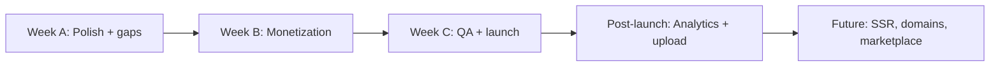

# Portfolio Builder — Remaining Work Plan

Ordered **smallest → biggest**, with a recommended execution plan. Based on `PORTFOLIO_BUILDER_TODO.md`, `PORTFOLIO_BUILDER_FEATURE_PLAN.md`, and the current codebase.

**Last updated:** June 2026

---

## Current Status

**Done (MVP core):** Phases 1–4 in the tracker — backend CRUD, publish/public slug, 5 themes (3 MVP + Cyber Dev + Creative), editor, AI helpers, basic analytics counters, nav links, section order/visibility, `react-helmet-async` on public pages.

**Not done:** Phase 5 (monetization), Phase 6 (QA + launch), plus several **schema/UI gaps** (model fields exist but editor or public UX does not use them fully).

---

## Remaining Work — Smallest to Biggest

### Tier 1 — Quick Polish (hours each)

| # | Task | Why it matters |
|---|------|----------------|
| 1 | **Release notes / changelog** entry for portfolio | Phase 6 checklist |
| 2 | **Dashboard analytics cards** — show `contactClicks` + `projectClicks` (backend already tracks) | Only views + resume clicks shown today |
| 3 | **Public SEO completeness** — `og:image`, Twitter card, canonical URL | Plan lists these; `PublicPortfolio` only has title/description/og:title/description |
| 4 | **SEO keywords + ogImage** fields in editor | AI sets `keywords`; no UI to edit keywords/og image |
| 5 | **Publish settings panel** — `showResumeDownload`, `allowIndexing`, `showSmartNShineBranding` | In `Portfolio.model.js`; not exposed in `PortfolioEditor` |
| 6 | **Enforce `allowedTiers` in theme picker** | `themeRegistry.js` defines tiers; editor lists all themes to everyone |
| 7 | **Preview button icon** | Dashboard uses chart icon for Preview (cosmetic) |

### Tier 2 — Small Features / Fixes (0.5–2 days each)

| # | Task | Gap |
|---|------|-----|
| 8 | **Real resume download** on public portfolio | “Resume” button tracks click but `PublicPortfolio` scrolls to `#contact`, no PDF |
| 9 | **Profile / hero image URL fields** in editor | Model supports `profileImage`, `heroImage`; no editor inputs |
| 10 | **Multiple social links** editor | Only “primary” social link; model supports array |
| 11 | **Project rich fields in editor** | Themes render `problem`, `solution`, `impact`, `highlights`, `images`; editor mostly title/desc/links |
| 12 | **SmartNShine branding** on public themes | `showSmartNShineBranding` in model; not rendered in theme components |
| 13 | **Rate-limit public analytics** POSTs | Feature plan calls this out; public routes have no dedicated limiter |
| 14 | **Unsaved-changes warning** | Manual save only; no blocker when leaving editor |
| 15 | **Align pricing table with reality** | Pricing shows Portfolio = Pro only; routes use generic `checkSubscription` (any logged-in tier can use portfolio) |

### Tier 3 — Launch Blockers (Phase 5 + 6) (~3–5 days)

| # | Task | Tracker |
|---|------|---------|
| 16 | **Free plan: 1 portfolio max** | Phase 5 |
| 17 | **Paid plans: higher portfolio limits** | Phase 5 |
| 18 | **Theme gating** (free vs one-time vs pro) on API + UI | Phase 5; registry ready, not enforced |
| 19 | **Branding removal** by plan | Phase 5 |
| 20 | **Analytics access** by plan (e.g. detailed stats = Pro) | Phase 5 |
| 21 | **Pricing page copy** — limits, themes, portfolios per tier | Phase 5 |
| 22 | **Full QA pass** (8 manual test items in TODO) | Phase 6 |
| 23 | **`PortfolioAnalytics` page** (`/portfolio/:id/analytics`) | Planned in Week 4; route/page missing; dashboard has mini stats only |

### Tier 4 — Product Enhancements (1–2 weeks each)

| # | Task | Notes |
|---|------|-------|
| 24 | **Autosave** in editor | Planned; explicit Save today |
| 25 | **Dedicated analytics UI** — trends, per-project clicks, date ranges | Needs `PortfolioView` model (plan §16) |
| 26 | **Image upload** for profile/projects (multer → Cloudinary/S3) | Plan: URLs for MVP, upload in phase 2 |
| 27 | **Create portfolio without resume** (“Start from scratch”) | Phase 2 in feature plan; create flow is resume-only |
| 28 | **Theme previews** (thumbnails/cards vs text list) | Week 3 polish item |
| 29 | **Font preset picker** | `fontPreset` in model; unused in UI/themes |
| 30 | **Later AI** — theme recommendation, completeness score, JD match | Plan §13 “Later AI” |

### Tier 5 — Large / Post-MVP (weeks+)

| # | Task |
|---|------|
| 31 | **SSR or static pre-render** for `/u/:slug` (SEO for Google/social crawlers) |
| 32 | **Custom domains** |
| 33 | **Advanced analytics** (referrer, device, country, privacy policy) |
| 34 | **Blog**, **theme marketplace**, **drag-and-drop section builder** |
| 35 | **Multiple portfolios per resume**, **static site export** |
| 36 | **Password-protected recruiter view**, **3D/heavy animation themes** |

---

## Recommended Execution Plan

### Sprint A — Ship-Ready Polish (2–3 days)

Do Tier 1 + items 8–12 from Tier 2.

**Outcome:** Public page feels complete (SEO, resume download, branding, project depth).

### Sprint B — Monetization & Access Control (2–3 days)

Phase 5: limits, theme tiers, branding/analytics gates, pricing copy.

**Outcome:** Product matches pricing; free users cannot abuse unlimited portfolios/themes.

### Sprint C — Beta Launch (2 days)

Phase 6 QA checklist + release notes + optional `PortfolioAnalytics` page.

**Outcome:** Confident beta release.

### Sprint D — Differentiation (1–2 weeks)

Autosave, image upload, analytics events model, start-from-scratch flow.

**Outcome:** Competitive portfolio product, not just “resume → webpage.”

### Sprint E — Platform (ongoing)

SSR, custom domains, marketplace — only after usage validates demand.

---

## Priority Order (Linear Backlog)

1. Real resume PDF download
2. Enforce theme tiers + portfolio count limits
3. Editor: publish settings + profile/hero images + project images/impact fields
4. Public SEO (og:image, canonical)
5. `PortfolioAnalytics` page + plan-based access
6. QA + release notes
7. Pricing alignment
8. Autosave + upload + from-scratch + advanced analytics
9. SSR / custom domain / marketplace (later)

---

## Assessment

**MVP build is ~85–90% done.** What remains is mostly **monetization enforcement**, **launch QA**, and **closing gaps** between the data model and what users can edit/see (images, branding, resume download, full SEO, tier-gated themes).

**Biggest mismatch today:** Pricing shows Portfolio = Pro only, but code does not gate portfolio creation by tier — address in Sprint B before marketing the feature widely.

---

## Related Docs

- `docs/guides/PORTFOLIO_BUILDER_TODO.md` — implementation checklist (Phases 1–6)
- `docs/guides/PORTFOLIO_BUILDER_FEATURE_PLAN.md` — full product/architecture spec
